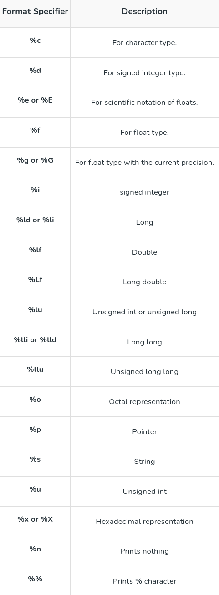
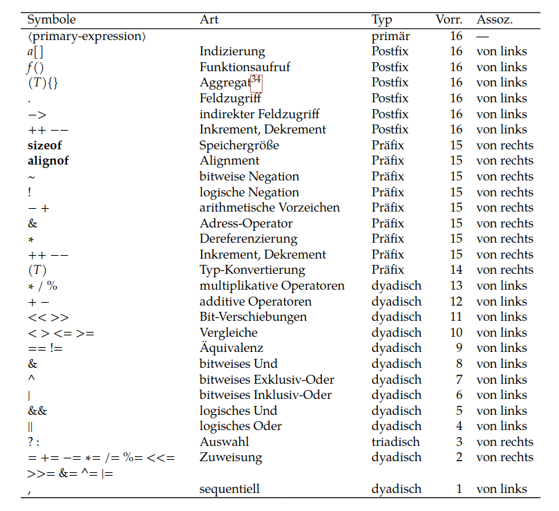
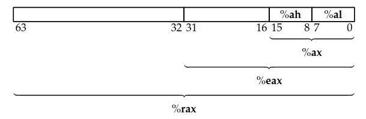

# Format Specifiers

## Number Prefixes
| **Prefix** | **Base** | **Example** | **Supported Since** |
|------------|---------|-------------|----------------------|
| `0` | Octal (Base 8) | `077` | C89 |
| `0x` or `0X` | Hexadecimal (Base 16) | `0x1F` | C89 |
| `0b` or `0B` | Binary (Base 2) | `0b1010` | C23 (or GCC extension) |
## Print in Binary
# Operator Vorrang

# Declaration Precedence 
int ** a[19]
# Preprocessor
# Makefile
```Makefile
target : prerequisites
    recipe
```
Vergleicht Timestamps von target und prerequsites und aktualisiert das target durch Ausführung des Recipe wenn die prerequisites neuer als das target sind.

Beispiel:
```Makefile
main : main.o util.o def.o
    gcc -o main.o util.o def.o

main.o : main.c def.h util.h
    gcc -c main.c

util.o : util.c util.h

def.o : def.c def.h
```
# System Calls
