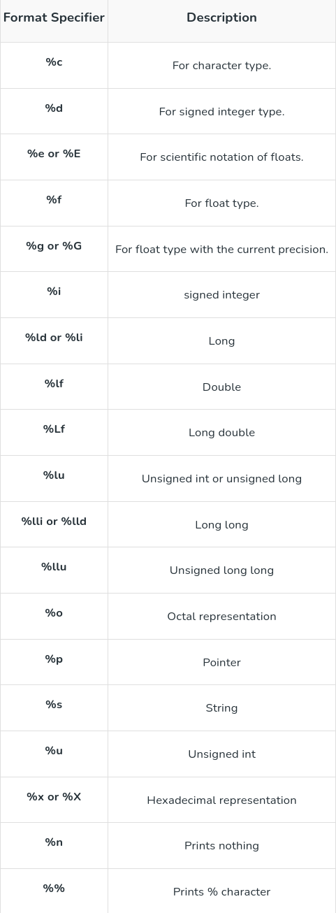
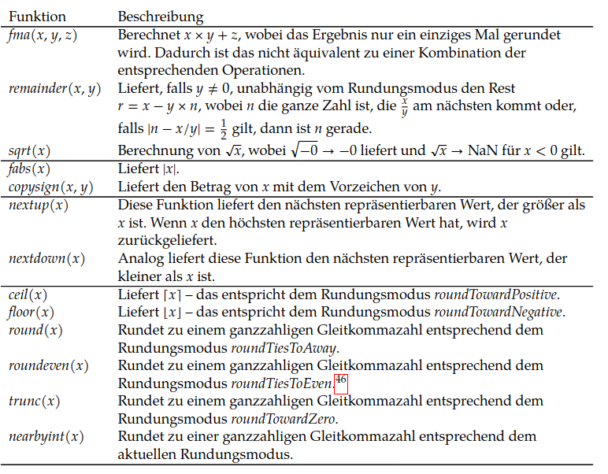
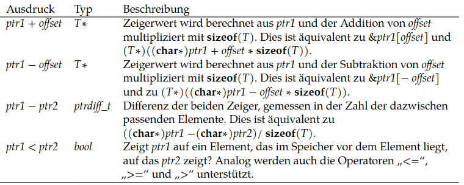

# [x][ ]1: Einführung und erste Schritte mit C

- 3 Kernelfunktionen: Zugriff auf Peripherie, Hardware-Ressourcen Verwaltung, Schnittstelle für Anwendungsprogramme
- POSIX als Standard für Schnittstellen, die vom OS implementiert werden, garantiert jedoch keine vollständige Portabilität
- C als Assembler Alternative für Portabilität 
## System- vs Funktionsaufrufe
Systemaufrufe sind aufgrund des erforderlichen Kontextwechsels und ihrer oft asynchronen Natur zeitlich teurer als Funktionsaufrufe,
welche im selben Ausführungskontext bleiben.
Systemaufrufe sollten daher in performanten Programmen minimiert werden und können mit `strace` verfolgt werden.
## Der Übersetzungsprozess und Übersetzungseinheiten
Die spezifischen Maschinen-Instruktionen sind in den C-Bibliotheken der jeweiligen Plattform hinterlegt.
```bash
as # GNU assembler
ld # GNU linker
```
Statt dem modernen Modulkonzept `import` verwendet C (und seine Derivate) einen Präprozessor, dessen Direktiven durch # gekennzeichnet sind.
Mit `gcc -E` kann dessen Ausgabe analysiert werden.
```c
#define abc=ABCDEFGHIJKLMNOPQRSTUVWXYZ // string replace
#include <stdio.h> // include header file by pasting it here, <> for system files, "" for relative path
```

## Aufbau einfacher C-Programme
```c
sizeof(int);
```
## Kontrollstrukturen
if, else, else if
for
while
do while
## Einfache Ein- und Ausgabe
Wird durch `<stdio.h>` bereitgestellt.
Im Gegensatz zu `puts` fügt `printf` keinen impliziten Zeilenumbruch an und unterstützt Formatierungsoptionen für Variablen.
- %d für int in dezimal
- %s string
- %f float dezimal komma
- %e float dezimal exponential
- %zu size_t (aus `sizeof()`)



Im Normalfall überliest `scanf` dafür auch vorangehende Leerzeichen, dies kann mit einem Leerzeichen in der Format-Zeichenkette ebenfalls spezifiziert werden.

```c
#include <stdio.h>
...
int x0, x1;
//TODO also catch EOF
// returns number of arguments read
if (scanf("%d %d", &x0, &x1) !=2){
    printf("Input failed %d, %d \n", x0, x1 );
}
```
Der Compiler kann wie folgt aufgerufen werden:
```bash
gcc -o output \
-std=c11 \
-g #debug info for gdb
```
# [x][ ]2: Ganzzahlige Datentypen
## Repräsentation 
Signed (vorzeichenbehaftete) ganze Zahlen werden heute durch das b-Komplement dargestellt (2-Komplement), da so keine Unterscheidung zwischen signed und unsigned Addition notwendig ist.
Aus der Perspektive des Speichers wird hier vom ursprünglichen Intervall $[0, 2^n-1]$ für unsigned das Intervall $[2^{n-1}, 2^n-1]$ reserviert(also MSB =1).

## Enumeration
```c
enum Level {
  LOW = 25, //oder ohne explizite Definition, dann implizit 0..2
  MEDIUM = 50,
  HIGH = 75
};
```

## Auswahl, Risiken, Überläufe
Überläufe können bei allen Operationen auftreten, irrelevant ob signed oder unsigned.
Unterschiedlich ist allerdings die Behandlung bzw. die Anzeichen, da ein Überlauf einer _signed_ Zahl einen Übergang ins negative Bedeutet,
während ein Überlauf von unsigned nur auftritt wenn die Größe des Registers überschritten wird.
Bei x86-64 gibt es dafür ein Statusregister namens EFLAGS. TODO


Ein Überlauf lässt sich somit bei unsigned mit CF, bei signed mit dem OF Flag erkennen.
Hier die Größen der in C üblichen ganzzahligen Datentypen in Byte. Pointer haben die der Architektur entsprechende Größe, bei 64 Bit also 64 / 8 Bit = 8 Byte.
> char (1) <= short (2) <= unsigned / int (4) <= long (4/8) <= long long (8)
# [x][ ]3: Gleitkommazahlen (IEE754)
Darstellung als Vorzeichen s mit Mantisse m und Exponent e, wobei die Mantisse als $1,m$ also als wissenschaftl. binäre Notation interpretiert wird.
$$ s*m*b^e $$
Spezielle Werte:
- Zero (EXP=0, FRAC=0)
- Subnormal (EXP=0, FRAC≠0). Hier wird die führende implizite 1 zu einer 0.
- Infinity (EXP=255, FRAC=0)
- NaN (EXP=255, FRAC≠0)
Längen sind s=1,e=8,m=23 (float) und s=1,e=11,m=52 (double/long float), eventuell auch längere Datentypen mit `long double`.
## Methoden:
- `isfinite()` aus `<math.h>` (false bei ∞, NaN)
- `fpclassify()` (FP_INFINITE, FP_NAN, FP_NORMAL, FP_SUBNORMAL, FP_ZERO)
- `strtod()` aus `<stdlib.h>`

- aus `<math.h>`:


# [x][ ]4:Arrays und Zeigerarithmetik
Größe eines Datentyps `sizeof()` ist immer vielfaches der Ausrichtung `alignof()`, die bestimmt an welchen Adressen im Speicher ein Objekt beginnnen kann.
Da Arrays in C kein primitiver Datentyp sind, wird bei der Übergabe an Funktionen nur ein Zeiger auf das erste Element übergeben, die Länge des Arrays geht verloren.

```c
int a[16];
char hello1[] = {'G','H','I'}; // nicht null-terminiert
printf(”%.∗s\n”, (int) sizeof(hello1), hello1);
char hello2[] = "ABC";
const char* hello3 = "DEF"; // nur Zeiger, kein Schreibzugriff, sizeof liefert Zeigerlänge
```

Ideale Übergabe durch:
```c
void foo(size_t len, int (∗a)[len]) {;}
```

## Methoden
- `int strcmp(str, str2)` aus `<string.h>`
- `strcpy(src, target)`


## VLA
VLAs (Variable Length Arrays), deren Länge zur Laufzeit definiert wird, wurden mit C99 eingeführt, werden jedoch weder im Linux Kernel noch in C++ verwendet
und werden gemeinhin als Fehler im Sprachstandard betrachtet. Mittels `gcc -Wvla` kann man Warnungen bei ihrer Nutzung erhalten.

## Zeigerarithmetik
Erlaubt sind Addition und Differenzen, solange die Zeiger vom gleichen Typ sind und die Arraygrenzen nicht verletzt werden (in das gleiche Array zeigen).


## Mehrdimensionale Arrays
Zeilenweise oder Spaltenweise in 1d reduzieren oft sinnvoll für Speicheroptimierung.
# [x][ ]5: Verbunde und dynamische Datenstrukturen
```c
struct myStructure {
  int myNum;
  char myLetter;
  char myString[30];
};
// declare type with definition and name, can also be declared inline
// typedef struct myStruct{} myStruct;
typedef struct myStructure myStructure;

int main() {
  // Create a structure variable and assign values to it
  // assignment to strings works using this method but not using s1.myString, an alternative would be strcpy
  struct myStructure s1 = {13, 'B', "Some text"};
```
TODO: union
# [x][ ]6: Virtueller Adressraum und Speicherverwaltung
aus `<stdlib.h>`:
- `void* malloc(size_t size);`
- `void* calloc(size_t nelem, size_t elsize);`
- `free(void* ptr);`

TODO: mmap
# [ ][ ]7: Speicherverwaltungsalgorithmen
# [ ][ ]8: Kommandozeilenparameter und Einbettung in die Shell
```c
int main(int argc, char ∗argv[]){

}
```
TODO: exec, readline
# [ ][ ]9: Modularisierung
- `extern` für reine Deklaration. Außerdem kann damit eine globale Variable in den aktuellen bereich gebracht werden.
- `static` bedeutet in C dass eine Variable nur für die aktuelle Übersetzungseinheit (Datei) sichtbar ist

## Makefile
```Makefile
target : prerequisites
    recipe
```
Vergleicht Timestamps von target und prerequsites und aktualisiert das target durch Ausführung des Recipe wenn die prerequisites neuer als das target sind.

Beispiel:
```Makefile
main : main.o util.o def.o
    gcc -o main.o util.o def.o

main.o : main.c def.h util.h
    gcc -c main.c

util.o : util.c util.h

def.o : def.c def.h
```
# [ ][ ]10: Dateisysteme
# [ ][ ]11: Sichere Programmierung
# [x][ ]12: Systemaufrufe
Verfolgung mittels `strace` (Solaris: `truss`), die Systemaufrufnummer wird im Register `%rax` übergeben.
Dateideskriptoren sind vorbelegt mit:
- 0: stdin
- 1: stdout
- 2: stderr
## Ein- und Ausgabe
### Öffnen
Dateien werden geöffnet mit `int open (const char* Path, int flags);`
oder erstellt mit `int creat(const char *pathname, mode_t mode);`
aus `<fcntl.h>`.
Gibt bei Erfolg einen positiven Dateideskriptor zurück.
Unterstützt werden folgende Flags:

- O_EXEC: nur zum Ausführen eröffnen
- O_RDONLY: nur zum Lesen eröffnen
- O_SEARCH: ein Verzeichnis nur zum Durchsuchen eröffnen (z. B. zur Verwendung als ersten Parameter bei openat)
- O_WRONLY: nur zum Schreiben eröffnen
- O_RDWR: zum Lesen und Schreiben eröffnen

Außerdem können per log. Oder (`|`) bspw. noch folgende Flags zusätzlich verwendet werden:

- O_APPEND: Vor jeder Schreiboperation wird die Dateiposition implizit an das Ende gesetzt.
- O_CLOEXEC: Setzt das FD_CLOEXEC-Flag, das dazu führt, dass der Dateideskriptor automatisch bei dem execve-Systemaufruf geschlossen wird.
- O_CLOFORK: Setzt das FD_CLOFORK-Flag, das dazu führt, dass der Dateideskriptor nicht an neu erzeugte Prozesse vererbt wird.
- O_CREAT: Lege die Datei neu an, falls sie noch nicht existiert.
- O_DIRECTORY: Das Eröffnen ist nur bei einem Verzeichnis erfolgreich.
- O_EXCL: In Verbindung mit O_CREAT kommt es zu einem Fehler, falls die Datei bereits existiert.
- O_NOFOLLOW: Wenn path auf einen symbolischen Link verweist, dann wird diesem nicht gefolgt und das Öffnen schlägt fehl.
- O_TRUNC: Die Datei wird, falls sie bereits existiert, auf die Länge 0 gekürzt.
### Lesen/Schreiben
Dateien werden gelesen mit `ssize_t read(int fd, void buf[.count], size_t count);`,
geschrieben mit `ssize_t write(int fd, const void buf[.count], size_t count);`
und verkleinert / vergrößert mit `int ftruncate(int fd, off_t length);`
aus `<unistd.h>`

Außerdem steht `off_t lseek(int fd, off_t offset, int whence);` zur Verfügung, das den Zeiger innerhalb der Datei verschieben kann.
Gibt bei Erfolg den resultierenden Offset in Bytes vom Dateibeginn zurück, sonst -1.
_whence_ kann dabei folgende Werte haben:
- SEEK_SET: The file offset is set to offset bytes.
- SEEK_CUR: The file offset is set to its current location plus offset bytes.
- SEEK_END: The file offset is set to the size of the file plus offset bytes.

### Schließen
Dateien werden geschlossen mit `int close(int fd);`
aus `<unistd.h>`.
Bei einem Fehler wird -1 zurück gegeben und errno (`<errno.h>`) enthält den Wert des Fehlers.

### Kopieren
TODO: mmap, memcpy
# [ ][ ]13: Interne Datenstrukturen des Kernels und atomare Operationen
# [ ][ ]14: Gepufferte Eingabe und reguläre Ausdrücke